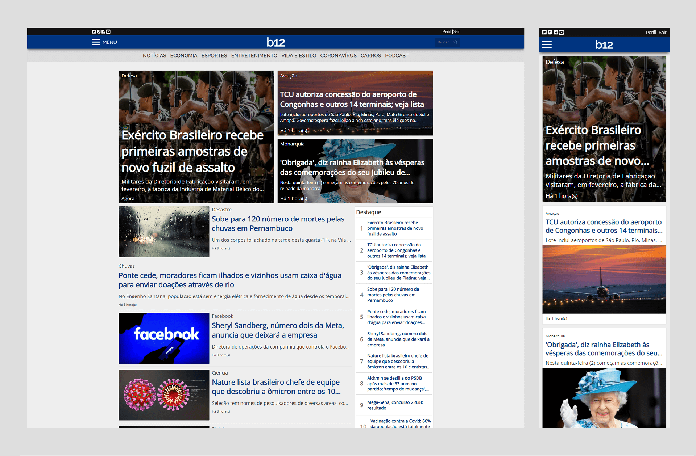

# b12 News (Back-end)

Front-end corresponding: https://github.com/GiovanniLeite/b12-news-front-end

## 📋 Presentation

Taking inspiration from popular news portals, this project is a comprehensive endeavor covering full-stack development. Utilizing Next.js and TypeScript, the front-end delivers a polished user experience, while the back-end leverages Strapi for content management, Cloudinary for image hosting, and a PostgreSQL database managed via Docker. The website encompasses essential pages such as Home, News, Search, Category, Login, Registration, and Profile. Notable features include advanced search functionality by name or category, seamless pagination, reader comments, highlighted news sections, related articles, and exclusive access for registered users. The project received its last update in July 2023.

## 🛠️ Back-end built with
- JavaScript
- Strapi (Headless CMS)
- Cloudinary (Imagens em nuvem)
- Docker
- PostgreSQL

## 🔧 Installation

- Install dependencies: `npm install`

- Configure environment variables: `cp .env.example .env`

- Start development application: `npm run develop`

## 🖼️ Images
#### Post
- cover: 1920x1080
- thumbSquare: 1080x1080

## 📫 Contact

